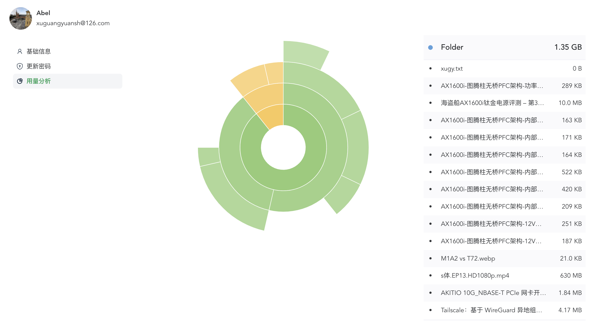

# 私有海量资料维查平台


&nbsp;&nbsp;&nbsp;&nbsp;&nbsp;&nbsp;&nbsp;&nbsp;将文件拖入共享目录，之后便可在页面高效检索。服务监控文件系统，自动维护索引，索引基于DB。所说“海量”，要自备超大容量存储，像作者这里用的是ceph；并当检索效率不足时，自行另建高性能数据库。因此，理论上，只要中间件性能足够，就可支持无限量文件检索。

##### ____\_下图：B站视频，无声、点击可播放。
<a href="https://www.bilibili.com/video/BV1rN4y177Li?share_source=copy_web&vd_source=1a48a07ee07e3015bd38436d9885f537" target="_blank"></a>

## 优势
- 使用smb挂载，无需取回本地，可直接操作文件。
- 实时维护索引，smb中 '增/改' 档案，页面可立即检索。

## 特点
- 不需要先建平台，从页面上传数据，才能被软件管理。
- SeaFile可对已知目录构建索引（首次启动，构建全部索引，之后自动维护）。
- 索引实时更新，类似 windows 上的 everything。

## 环境
- CentOS、Alpine 等（ext4、xfs）（Linux 为未来的主要支持方向）
- macOS（APFS）（Finder下部分操作感知不到，命令行下操作没问题）
- Windows（待测试，理论上没问题）
- Internet（是的，界面服务使用了CDN资源，这意味着，作为发起请求的客户机，需要接入互联网，而非只需要内网。如确实希望剔除对公网的依赖，需要从源码自行编译，并移除CDN相关配置）
- PostgreSQL，当前仅支持 PG 数据库。

## Screenshots
|                      |                      |  |
|:-------------------------------------------------------:|:-------------------------------------------------------------:|:-------------------------------------------------:|
|                          |                          |                                                   |
|  |  |                                                   |


## 注意
- 初始账号：
  - 系统首次启动，会创建初始的账号密码：root、123456。
  - 建议在启动后，用其创建自定义的管理员账号，之后移除该 root 账户。
- 账号密码：
  - 密码采用了可还原的加密算法来存储。
  - 原因是，当基于k8s进行部署时，在发生调度时，需在新容器中重建smb账号信息，需知道原始账号密码。
- 资源固定搜索路径：
  - /home/{account}/xxx

## 推荐部署架构


## 构建
```shell
cd webapp
yarn install && yarn build && cd ..
cargo build --release
export env=dev
cp target/release/seafile ./
cp profiles/$env/config.yaml ./
tar zcvf app.tar.gz dist seafile scripts config.yaml
```

## 镜像
&nbsp;&nbsp;&nbsp;&nbsp;&nbsp;&nbsp;&nbsp;&nbsp;samba能力，来自 `.dockerfile` 文件中的基础镜像 `auraco/samba:alpine`，该镜像已提交至 hub.docker.com。如不需要samba功能，则转而去使用 scratch、alpine 也是一样的。

&nbsp;&nbsp;&nbsp;&nbsp;&nbsp;&nbsp;&nbsp;&nbsp;env、repo 根据实际情况填写：

```shell
cp target/release/seafile .
strip seafile && upx -9 seafile
cp profiles/$env/* ./
tar zcvf app.tar.gz dist seafile scripts config.yaml
mkdir -p docker && cp app.tar.gz .dockerfile docker/ && cd docker/
export repo=seafile
docker build --pull -f .dockerfile --build-arg APP_ENV=$env -t $repo .
```

## 部署

&nbsp;&nbsp;&nbsp;&nbsp;&nbsp;&nbsp;&nbsp;&nbsp;因缺少 iOS、Android 等移动端 App，因此可以选择与 nextcloud 搭配使用。由于 nextcloud 的安装目录需要是空的，所以原理上需要先安装 nextcloud，再安装 SeaFile。同时，使用中需确保 SeaFile、NextCloud、smb 等全部服务的工作目录相同。但有如下事项需要注意：

- nextcloud 只能 浏览、使用，经由 nextcloud 上传的。
- 从 smb、nfs、ftp、scp、nextcloud 等上传的，可在 SeaFile 页面中 检索、使用。

#### 安装 SeaFile

```shell
# 1.部署 postgresql 数据库
docker run --restart=unless-stopped -p 5432:5432 -e POSTGRES_PASSWORD=postgres 
    --name postgres -d postgres:12-alpine
# 2.部署 seafile
docker run \
    -d -ti --pull always \
    --name seafile --restart unless-stopped \
    -p 8080:8080 -p 139:139 -p 445:445 \
    -v /data/samba:/home \
    abelco/seafile
```

## 挂载smb
### macOS
&nbsp;&nbsp;&nbsp;&nbsp;&nbsp;&nbsp;&nbsp;&nbsp;Command + k，输入服务地址，并根据随后提示，输入账号、密码。

### Windows
&nbsp;&nbsp;&nbsp;&nbsp;&nbsp;&nbsp;&nbsp;&nbsp;右键，此电脑，添加一个网络位置，`\\192.168.3.120\Yali`。（或，开始，运行，输入地址）（结尾的 share，请根据实际情况输入）。

### Android
- Astro File Manager
- AndSMB
- File Manager
- ES文件浏览器/ES File Explorer（据说广告多）
### iOS
- FileExplorer Free

## 检索、预览


<a href="https://www.bilibili.com/video/BV1rN4y177Li?share_source=copy_web&vd_source=1a48a07ee07e3015bd38436d9885f537" target="_blank"></a>

## 关于直接以本地smb打开

- macOS

  不需要做什么，直接点击打开即可。

- Windows

  开发中，大概过程：添加注册表、添加vbs脚本。

- Linux

  开发中，初期主要支持 ArchLinux 的 dolphin 。


## 迭代计划
| 序号  |                   功能                   | 状态  |
|:---:|:--------------------------------------:|:---:|
|  1  | 大范围的在线预览功能（txt、pdf、md、html、java、js、rs） | ... |
|  2  |      在线文档功能（markdown、onlyoffice）       | ... |
|  3  |               图片轮播功能（相册）               | ... |
|  4  |                 视频播放功能                 | OK  |
|  5  |                 多用户功能                  | OK  |
|  6  |              单一来源的索引维护并行化              | ... |
|  7  |        页面点过一个跳转链接后，总是滚到最上面（问题）         | OK  |
|  8  |        优化前端 history 功能，使前进/后退可用        | OK  |
|  9  |              checkbox 能力               | OK  |
| 10  |             下载选中、~~删除选中~~              | OK  |
| 11  |                 回收站、还原                 | ... |
| 12  |       排序：改为后端代码实现（改为 2-xxx < 11）       | OK  |
| 13  |          从浏览器打开finder本地smb路径           | ... |
| 14  |               文件大小显示格式化                | OK  |
| 15  |                文件类型图标完善                | OK  |
| 16  |           挂载 pv /etc/seafile           | ... |
| 17  |     生成配置 /etc/seafile/seafile.yaml     | ... |
| 18  |               最佳实践（架构图）                | ... |
| 19  |        支援 k8s pod 动态增减时，smb账户重建        | OK  |
| 20  |         支援 k8s 部署，从环境变量解析配置功能          | ... |
| 21  |                  页面上传                  | ... |
| 22  |                 用户旭日图                  | OK  |
| 23  |                 系统旭日图                  | OK  |
| 24  |     对图片、html，增加“合并打开”(iframe做单页渲染)     | ... |
| 25  |             登录页面向NaiveUI美化             | ... |
| 26  |                初始的管理账户                 | OK  |
| 27  |                初始密码学配置                 | OK  |


[//]: # (- 来源：FS事件、巡视校准)


---
### 参考资料
#### 界面
- https://github.com/actix/examples/tree/master/basics/static-files
- https://github.com/actix/examples/tree/master/basics/basics

#### 上传
- https://github.com/actix/examples/blob/master/forms/multipart-s3/src/utils/upload.rs
- https://github.com/actix/examples/blob/master/forms/multipart/src/main.rs

#### 下载
- https://actix.rs/docs/static-files/
- https://github.com/actix/examples/blob/master/basics/basics/src/main.rs

#### chrome（待测试）
- --autoplay-policy=no-user-gesture-required

