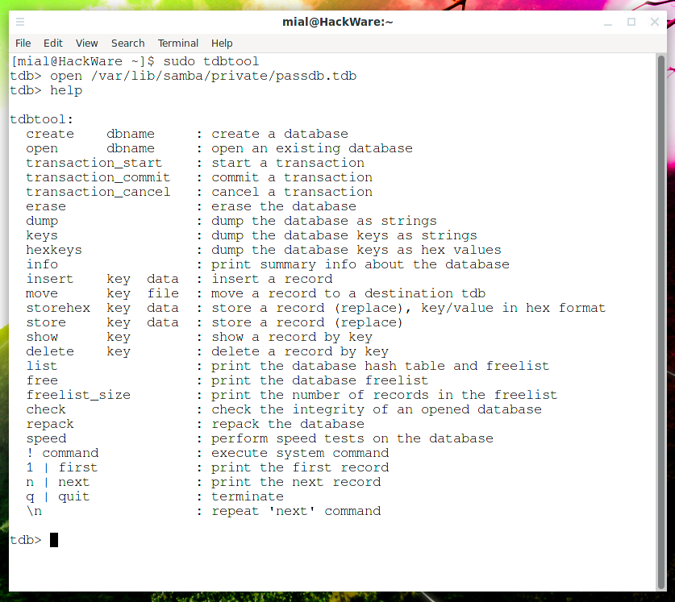
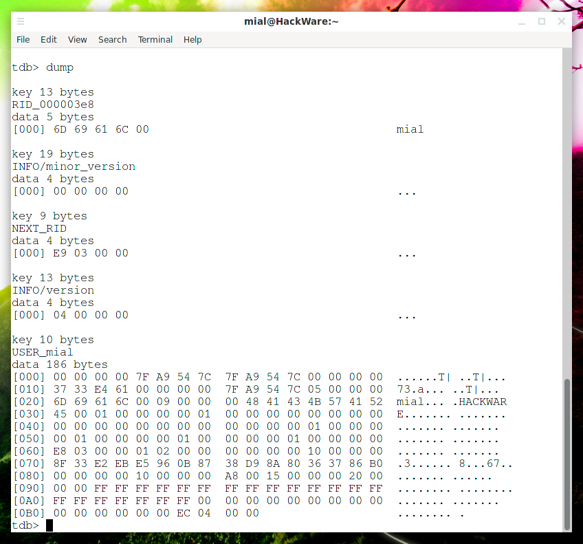
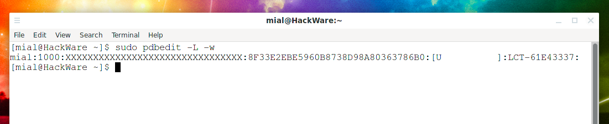
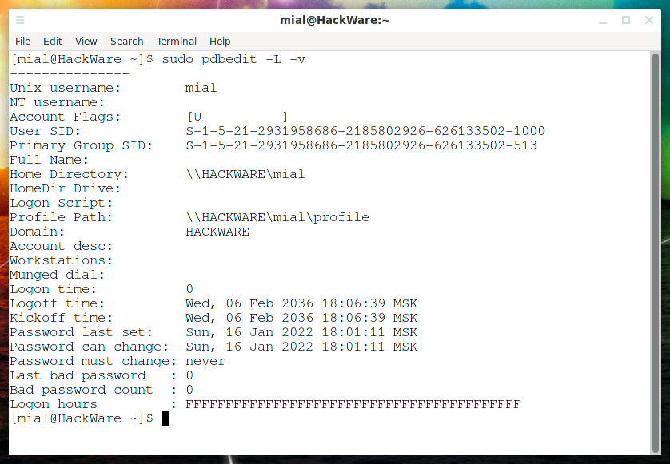

# Samba 存储密码的位置。如何提取 Samba 用户名和密码（已解决）

此条目介绍的是 Samba 密码数据库。它回答了有关 Samba 密码存储位置以及如何对 Samba 密码数据库执行常见操作的常见问题。

要设置 Samba 密码，请使用以下命令：

sudo smbpasswd -a USER
如果您希望用户没有密码，请指定 -n 选项。

另请参阅：SMB 和 Samba 安全审计工具

## Samba 在哪个文件中存储密码？

Samba 密码存储在 /var/lib/samba/private/passdb.tdb 文件中。

根据 Samba 的分布和版本，passdb.tdb 文件的路径可能不同。

## Samba密码文件passdb.tdb的格式是什么？

passdb.tdb 文件是二进制文件，不是纯文本文件。

passdb.tdb 文件可以使用 tdbtool 实用程序打开，但用户不能直接编辑此文件，包括使用 tdbtool效用。您还可以使用 pdbedit 实用程序导出和导入该文件的内容。

tdbtool 是一个用于显示和修改 Samba TDB（普通数据库）文件内容的工具。下面列出的每个命令都可以交互输入或在命令行上提供。

要打开 passdb.tdb 文件，您必须以 root 身份运行 tdbtool 实用程序，否则它甚至没有足够的权限查看此文件：

sudo tdbtool
然后运行“open”命令，指定要打开的文件的路径：

open /var/lib/samba/private/passdb.tdb
如果在打开过程中没有错误（例如，由于指定了错误的路径），则不会显示任何内容。

如需帮助，请键入

- 帮助

您可能会发现有用的流行命令：

- 列表

打印数据库的哈希表和空闲空间列表

- 转储

将数据库内容显示为字符串

- 键

将数据库键列表打印为字符串

- 信息

显示有关数据库的摘要信息

- 擦除

清除数据库

## 是否可以从 Samba 数据库中查看或提取密码？

不可以，无法从 passdb.tdb 文件中查看或提取密码。此外，passdb.tdb 文件不以纯文本形式存储密码，Samba 数据库仅包含密码哈希值。

使用的散列算法是 NTLM。在线 LM/NTLM 哈希生成器：https://suip.biz/?act=ntlm-hash-generator

您可以使用以下命令将哈希导出为十六进制字符串：

sudo pdbedit -L -w

以下命令将导出所有数据，包括哈希值：

sudo pdbedit -e smbpasswd:/root/samba-users.backup

## 如何查看Samba用户名？

您可以使用以下命令查看用户名：

sudo pdbedit -L
sudo pdbedit -L -v

## 如何从 Samba 数据库中删除单个用户？

要删除，请使用 -x (--delete) 选项。您还需要使用 -u 选项指定用户名，例如：

sudo pdbedit -x -u mial

## 如何擦除Samba密码数据库？

以下命令将擦除整个 Samba 密码数据库：

sudo tdbtool /var/lib/samba/private/passdb.tdb erase

## 如何管理Samba账号？

添加或修改用户帐户时，-c|--account-control FLAG 选项可与 pdbedit 命令一起使用。它将指定用户帐户控制属性。下面列出了可能的标志：

N：不需要密码
D：帐户已停用
H：需要主目录
T：其他帐户的临时副本
U：普通用户帐户
M：MNS登录用户帐号
W：工作站信任帐户
S：服务器信任帐户
L：自动上锁
X：密码不过期
I：域信任帐户
示例：-c [X ]

资料来自：[《Samba 存储密码的位置。如何提取 Samba 用户名和密码（已解决）》](https://cn.linux-console.net/?p=8781#gsc.tab=0)

